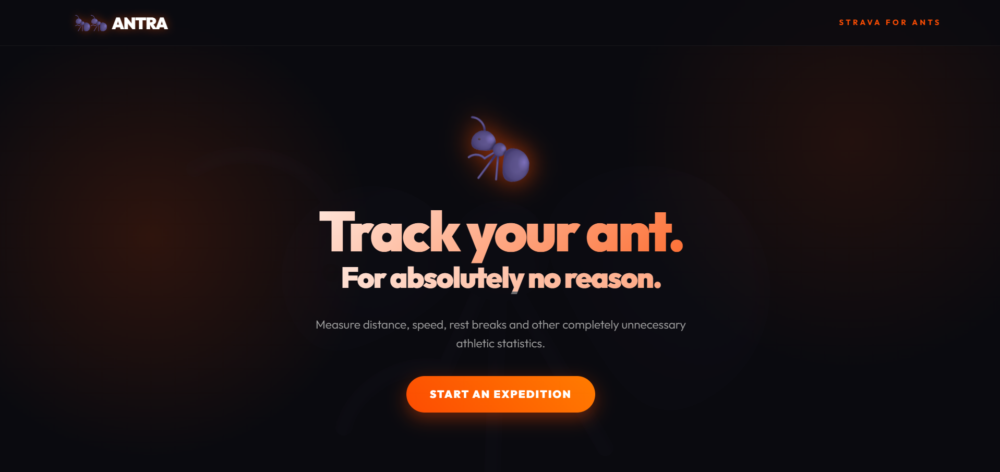
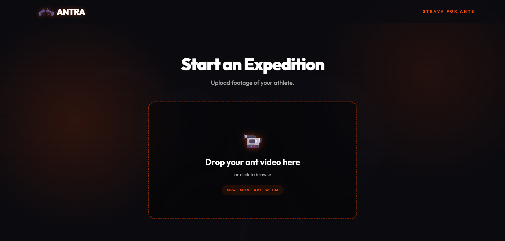
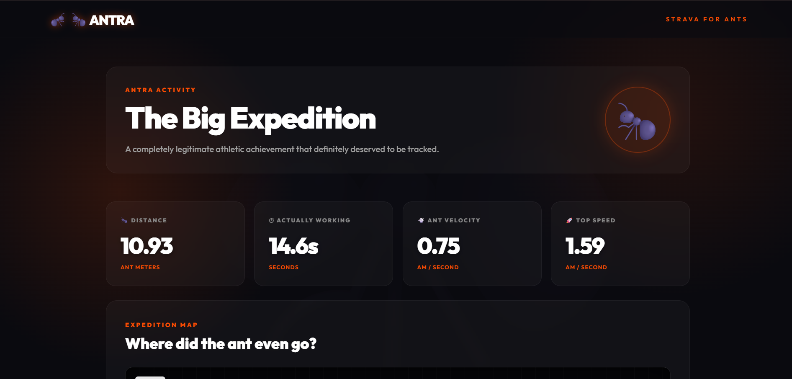
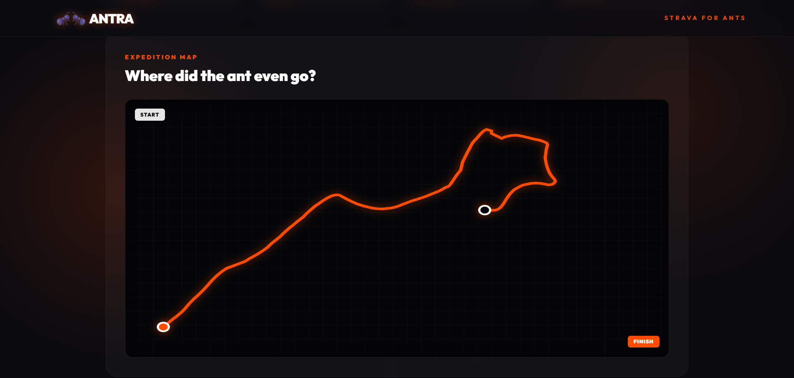
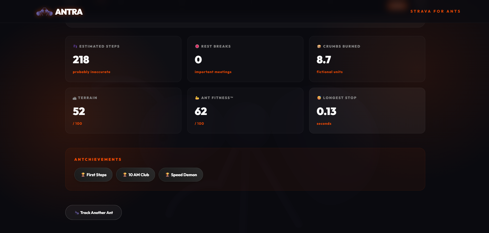
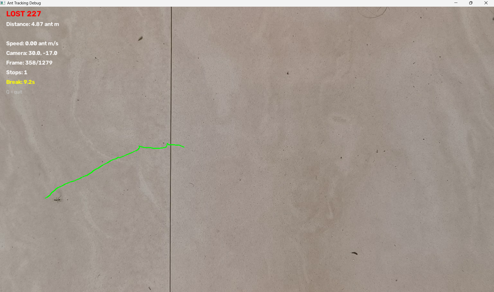

# ANTRA — Strava for Ants 🐜 🎯

> **Live :** [ANTRA](https://antra-7vjb.onrender.com/)  


## Basic Details
### Team Name: Zero


### Team Members
- Jion Biju - Vimal Jyothi Engineering College
- Richard Rarichan - Vimal Jyothi Engineering College

### Project Description
ANTRA is a premium, over-engineered athletic tracking platform designed exclusively for ants. It analyzes video footage of ants scurrying across your kitchen counter and generates completely unnecessary athletic statistics like Top Speed, Crumbs Burned, and Rest Breaks. 

### The Problem (that doesn't exist)
Humans get all the credit for running marathons, while ants walk the equivalent of 500 miles a day just to steal a grain of sugar. Yet, there is zero fitness tracking infrastructure for the formicidae community. Furthermore, ants notoriously refuse to carry smartphones, making traditional GPS tracking impossible.

### The Solution (that nobody asked for)
We built a state-of-the-art computer vision platform. You record an ant doing its thing, and our system tracks its exact path, calculates its "Ant Velocity" (AM/s), maps the expedition, and awards "Antchievements". We also gave it an absurdly premium, Apple-style dark mode UI because ants deserve luxury too.

## Technical Details
### Technologies/Components Used
For Software:
- **Languages used**: Python (Backend), HTML/CSS/JS (Frontend)
- **Frameworks used**: FastAPI, Uvicorn
- **Libraries used**: OpenCV (for over-the-top computer vision ant-tracking), NumPy
- **Tools used**: Git, Premium Glassmorphism CSS

For Hardware:
- A camera (to record the ant)
- Breadcrumbs (to bribe the athlete)
- A magnifying glass (optional, for intense coaching)

### Implementation
For Software:

# Installation
```bash
# Clone the repository
git clone https://github.com/TwistedDucky/antra.git
cd antra

# Set up the Python environment
python -m venv venv
venv\Scripts\activate

# Install the overly complex dependencies
pip install -r requirements.txt
```

# Run
```bash
# Terminal 1: Start the Computer Vision Backend
uvicorn backend.main:app --reload
```
Then open `http://localhost:5500` and prepare to be amazed.

### Project Documentation
For Software:

# Screenshots 

*The landing page.Notice the premium glassmorphism and the wobbly hero ant. Apple, take notes.*


*The highly sophisticated upload zone where you submit your ant footage. Spiders will be rejected.*


*The Results Dashboard. Shows the exact route, crumbs burned, and the number of times the ant stopped for a "meeting".*


*Activity Dashboard. We found the ant! Look at those impressive crumb-burning stats.*

*The Expedition Map. A complete visual representation of an ant wandering aimlessly.*

*OpenCV output.*


### Project Demo
# Video 1:AntraDemo

[https://www.youtube.com/watch?v=kh1ZGcWbOM8]

 # Video 2:Internal Working of Antra
[https://www.youtube.com/watch?v=RmvI3SCjMr4&feature=youtu.be]


---
Made with ❤️ at TinkerHub Useless Projects 


